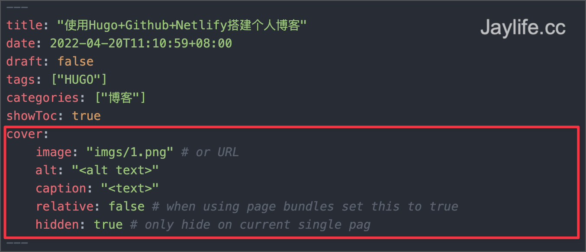
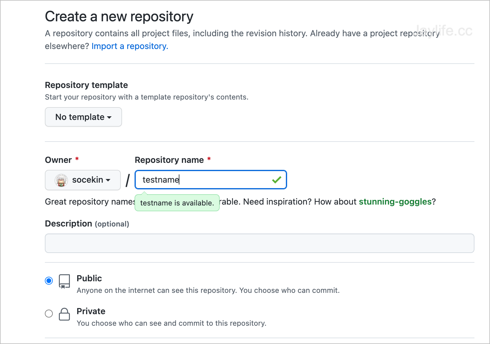
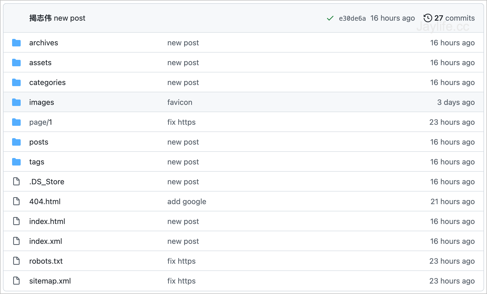
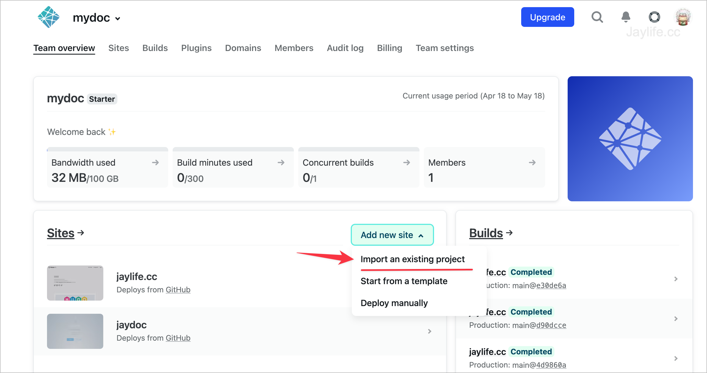
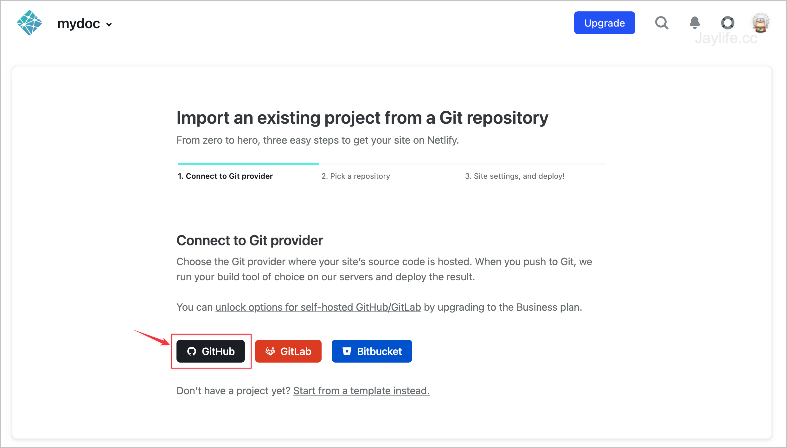
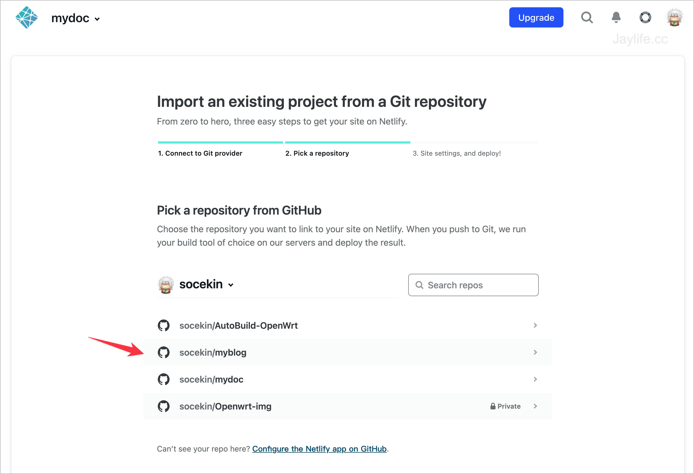

### 方案选择
13年前使用的Wordpress搭建博客，因为这些年习惯用markdown写作，所以打算用支持md写博文的框架，对比了Hugo和Hexo，对于建博客来说部署难度差不多，最终选择Hugo是因为看中了现在用的这款主题PaperMod，还有就是Hugo官方文档写得非常清楚，对于我这种小白来说很友好。

当然零基础部署Hugo中间还是遇到了一些问题，我把部署过程分享出来，希望对你有帮助。我采用的部署方案是Github+Netlify，后面我会介绍这个方案的好处。

> 以下教程基于macOS平台，如果是Windows平台，请参考官方教程

### 安装Hugo
参照Hugo官网的教程，非常简单就安装成功，[点这里](https://gohugo.io/getting-started/quick-start/)

#### 下载

1. 首先需要安装Homebrew，这是一个macOS包管理工具。复制以下命令到终端

```
/bin/bash -c "$(curl -fsSL https://raw.githubusercontent.com/Homebrew/install/HEAD/install.sh)"
```

2. 然后开始安装Hugo

```
brew install hugo

```
3. 安装成功之后，初始化一个网站，可以把``quickstart``换成你想命名的文件名，初始化成功后会在电脑生成该文件目录。

```
hugo new site quickstart -f "yaml"
```
> 增加``yaml``参数是因为后续使用的主题是采用yml配置文件

#### 文章结构设置
可以参照Hugo官网选择适合自己的文章组织结构方式，点[这里](https://gohugo.io/content-management/organization/)查看，下面是我的文章目录结构。

```
└── content
    ├── posts
    |   ├── blog name1   // 文章名字
    |   |   └── imgs  // 该文章需要用的照片
    |   |   └── index.md  // 文章内容
    |   ├── blog name2   // 文章名字
    |   |   └── imgs  // 该文章需要用的照片
    |   |   └── index.md  // 文章内容
```

如果没有posts目录可以使用以下命令生成

```
hugo new posts/my-first-post.md
```


### 安装主题
对于新手，一个好的主题可以节省大量的配置时间，我使用的是PaperMod主题，该主题有很多feature满足我的日常需求，比如封面、Auto Darkmode、评论集成等等，最重要的是简洁，非常推荐，更多该主题的介绍点击这里查看：[PaperMod](https://github.com/adityatelange/hugo-PaperMod/)

#### 下载主题

进入初始化网站的目录，``quickstart``，如果你更改过名字需要替换。
```
cd quickstart
```
安装主题，之后可以在``quickstart``文件夹里找到``themes``，里面已经下载好了PaperMod主题

```
git init
git submodule add --depth=1 https://github.com/adityatelange/hugo-PaperMod.git themes/PaperMod
```

#### 主题设置

主题的所有可配置项参照[文档](https://github.com/adityatelange/hugo-PaperMod/wiki/Features)按需设置，以下我介绍几个常用的配置

#### 开启评论

我用的是valine评论系统，非常简洁，和PaperMod主题比较搭，你需要按valine官网获取APP_id和APP_key，点击这里查看:[注册](https://valine.js.org/quickstart.html)

然后在本地站点文件夹``/你的网站文件夹/layouts/partials``下面新建``comments.html``，将以下代码复制，替换刚才注册的app id和key，保存


  ```
  <!DOCTYPE html>
  <html lang="en">
    <head>
      <meta charset="UTF-8">
      <title>Valine - A simple comment system based on Leancloud.</title>
      <!--Leancloud 操作库:-->
      <script src="//code.bdstatic.com/npm/leancloud-storage@4.12.0/dist/av-min.js"></script>
      <!--Valine 的核心代码库:-->
      <script src="//cdn.jsdelivr.net/npm/valine"></script>
    </head>
    <body>
      <div class="comment"></div>
      <script>
        new Valine({
          // AV 对象来自上面引入 av-min.js（ 老司机们不要开车哈 ➳♡゛）
          av: AV,
          el: '.comment', //
          app_id: 'xxx', // 这里填写上面得到的APP ID
          app_key: 'xxx', // 这里填写上面得到的APP KEY
          placeholder: '欢迎留言!' // [v1.0.7 new] 留言框占位提示文字
        });
      </script>
    </body>
  </html>
  ```

  打开本地``config.yml``文件，修改comments参数为``true``即可看到评论生效了

```
params:
    comments: true
```

#### 开启文章封面

首先修改``config.yml``文件，将封面功能打开，将``hidden:true``改为``false``

```
cover:
  hidden: false # hide everywhere but not in structured data
  hiddenInList: false # hide on list pages and home
  hiddenInSingle: true # hide on single page
```
然后在需要设置封面的文章，增加以下代码



### 部署
Hugo官方提供多种部署方式，常见的方式是部署到GitHub page，但是GitHub的服务在国内访问不稳定，也没有网页分析、CDN等网站服务，这里推荐[Netlify](https://www.netlify.com/)，傻瓜式配置，并且提供免费版本。

Netlify可以自动读取Github的静态网页文件，实时更新部署，我采用的方式是将Hugo提交到GitHub，由Netlify提供对外的访问服务。

#### Build网站

首先将本地写好的文章发布，本地目录``public``是网站部署需要的所有文件

```
Hugo -D
```


#### 创建Github
登陆github创建一个仓库，将Hugo发布的``public``文件夹里所有的文件提交到仓库根目录



提交成功后可以看到所有文件



#### 部署到Netlify

首先登陆Netlify注册账户，在``Team overview``点击``Add new site``，选择``import an exsiting project``


然后选择Github，之后会弹出Github登陆授权


授权成功后，可以看到Github的仓库，选择Hugo发布的仓库，点击下一步完成，其他参数不需要设置


> 如果Hugo发布的文件不在Github根目录，需要在site setting步骤的Publish目录修改

以上就是我部署博客的全过程，如果有其他疑问，欢迎留言交流
