### 为什么要自己编译固件
如果你在使用软路由，对于OpenWrt应该不陌生，肯定也纠结和尝试过各种网上的固件，对于大部分人来说，网上的固件是够用的，但我还是建议大家自己编译固件，因为网上的固件要么插件太多，要么自己想要的插件没有，其次就是编译的源码很多没有共享出来，你会不会也担心安全问题？

今天给大家分享一下如何使用Github Action进行云编译OpenWrt。

### 云编译

使用Github Action编译OpenWrt固件网上有很多教程，但是对于小白来说，还是不友好，我踩了不少坑，以下教程适合小白用户。

开始之前首先感谢以下几位大佬：

  - Lean: https://github.com/coolsnowwolf/lede
  - P3TERX: https://github.com/P3TERX/Actions-OpenWrt
  - kenzok8: https://github.com/kenzok8/small-package
  - fw876: https://github.com/fw876/helloworld


#### 工具准备

首先需要准备以下工具：

- 一个GitHub账户
- 一台装有Ubuntu的电脑或者虚拟机

为什么需要Ubuntu的电脑或者虚拟机呢？网上有教程通过Github Action的SSH功能也能实现编译，但是我实际验证非常容易报错和中断，所以建议大家采用Ubuntu系统来生成配置文件。

#### 创建Github仓库

登陆Github账户，访问P3TERX大佬的原始[仓库](https://github.com/P3TERX/Actions-OpenWrt)，根据P3TERX的说明，创建自己的仓库，步骤如下：

1.进入 P3TERX/Actions-OpenWrt 项目页面，点击页面中的 Use this template （使用这个模版）按钮。
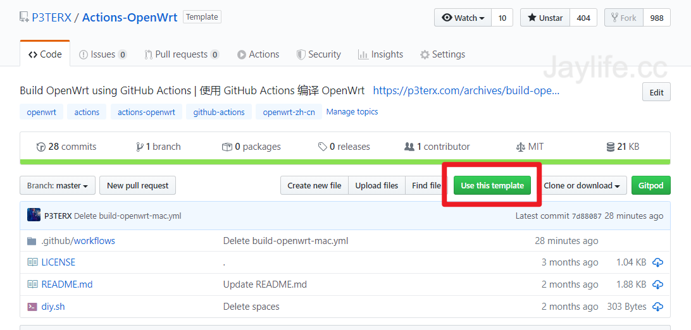

2.填写仓库名称，然后点击Create repository from template（从模版创建储存库）按钮。
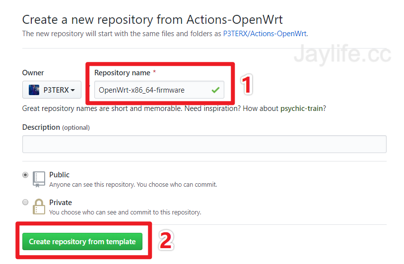

3.经过几秒钟的等待，页面会跳转到新建的仓库，内容和我的项目是相同的。然后点击Create new file（创建新文件）按钮。
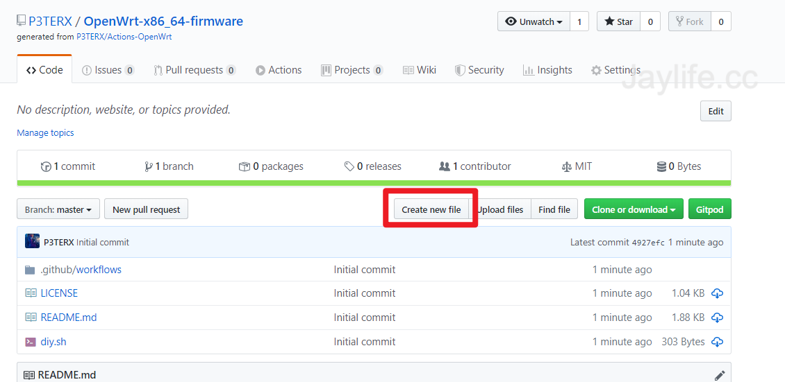

4.文件名填写为``.config``，这里不需要填写，后面会讲如何配置。
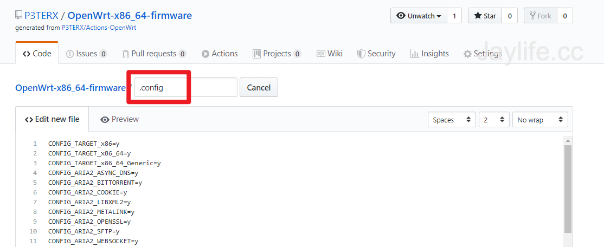

5.翻到页面最下方，点击Commit new file（提交新文件）按钮。
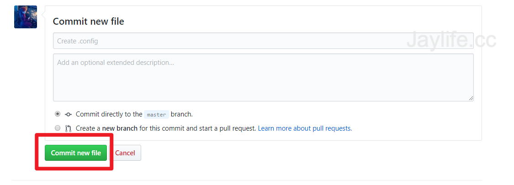

#### 修改sh（可选）

- 修改固件的IP地址

在Github Code页面，找到``diy-part2.sh``，点击编辑，修改默认IP地址，将``192.168.2.1``改为你想设置的地址即可。

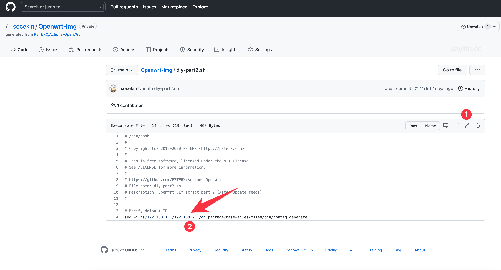

- 添加软件包库

在Github Code页面，找到``diy-part1.sh``，点击编辑，按需求增加编译时可选的软件包，以下三个是我所使用的，包含绝大部分支持OpenWRT的软件包，大家可以访问对应的地址，查看详细软件包仓库说明

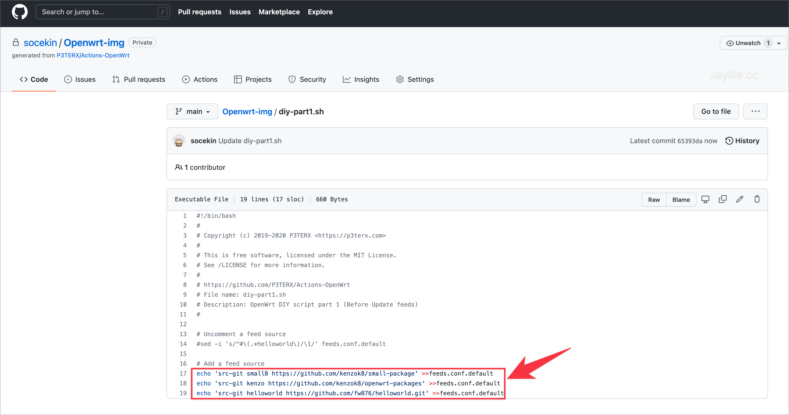

#### 生成Config文件

P3TERX大佬的脚本其实是支持SSH访问来生成Config，但是我几经尝试均失败，最后采用本地生成Config的方法成功了。

- 登陆Ubuntu系统，按Lean的[教程](https://github.com/coolsnowwolf/lede)进行编译

1.安装编译依赖

```
sudo apt update -y
sudo apt full-upgrade -y
sudo apt install -y ack antlr3 asciidoc autoconf automake autopoint binutils bison build-essential \
bzip2 ccache cmake cpio curl device-tree-compiler fastjar flex gawk gettext gcc-multilib g++-multilib \
git gperf haveged help2man intltool libc6-dev-i386 libelf-dev libglib2.0-dev libgmp3-dev libltdl-dev \
libmpc-dev libmpfr-dev libncurses5-dev libncursesw5-dev libreadline-dev libssl-dev libtool lrzsz \
mkisofs msmtp nano ninja-build p7zip p7zip-full patch pkgconf python2.7 python3 python3-pip qemu-utils \
rsync scons squashfs-tools subversion swig texinfo uglifyjs upx-ucl unzip vim wget xmlto xxd zlib1g-dev
```
2.下载源代码

```
git clone https://github.com/coolsnowwolf/lede
cd lede
```

3.进入本地的``LEDE``文件夹，修改feeds.conf.default文件，增加三个软件仓库

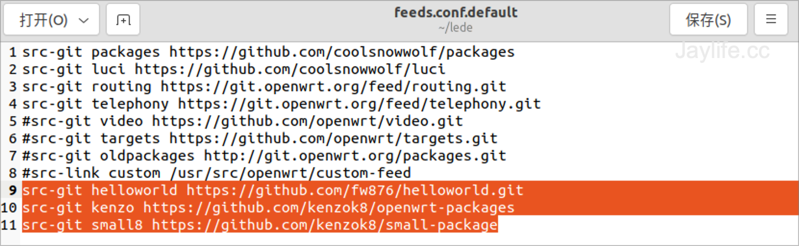

4.生成``.Config``文件

```
./scripts/feeds update -a
./scripts/feeds install -a
make menuconfig

```
- 之后就能看到OpenWrt的配置界面，按需选择想要的设置，然后保存。进入本地的``LEDE``文件夹，可以看到``.Config``文件

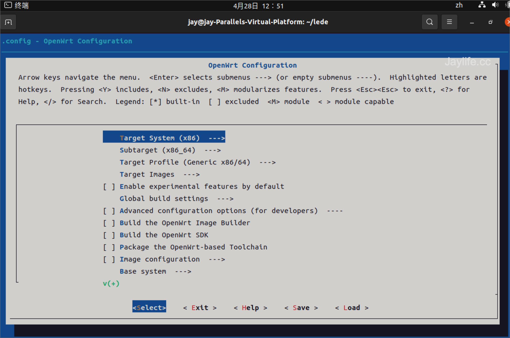

- 将``.Config``文件上传到Github仓库

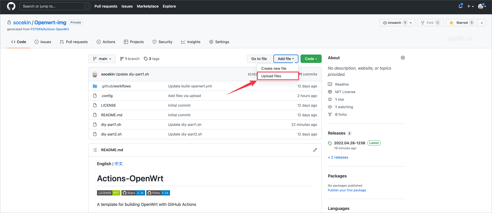

#### 开启Action编译

在Github页面，点击``Action``，选择``Build OpenWrt``，SSH默认为``false``，Run workflow即开始云编译，等待编译结束后，可以在Action页面看到固件。
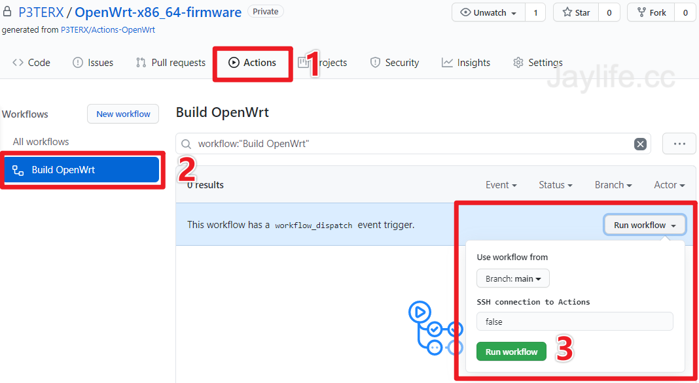


### 固件推荐
按上面的步骤，就实现了OpenWrt自由定制了，而且始终与Lean大佬的源码保持同步。如果你还是觉得自己编译还是麻烦，这里推荐几个我之前用过还不错的固件。

- Esir：[https://www.youtube.com/c/eSirPlayGround](https://www.youtube.com/c/eSirPlayGround)

  推荐使用原生OpenWrt Stable版本

- 佐仔志：[https://www.jinbo123.com/7806.html](https://www.jinbo123.com/7806.html)

  极致精简，但满足家庭使用需求。

- 我编译的：[https://github.com/socekin/Openwrt-img/releases](https://github.com/socekin/Openwrt-img/releases)

  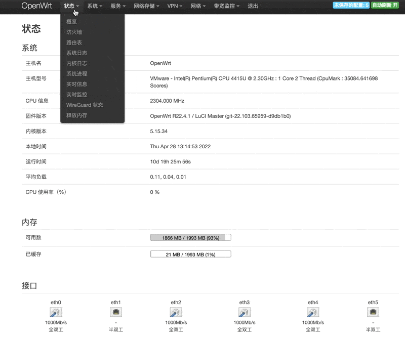

### 固件免费定制
我知道即便是这样的教程，可能还是会让很多小白望而却步，所以我决定免费为大家制作Config文件，然后把固件编译好，大家自行下载，请按如下模版，发送telegram消息给我或者直接留言。

> 默认IP地址xxx; 需要开启和关闭的插件清单xxx;
