### 你为啥需要Home Assistant？

“下班回到家附近自动开启空调、开门自动开灯、看电影时自动关灯...”，用过智能家居的朋友应该对这些自动化场景不陌生，目前的智能家居已经满足生活中很大一部分“智能”需求，生态中可选择的产品也越来越多。但是，国内外的几大厂商各自为营，所采用的协议、网关也是互不连通，这样导致想要更好的体验智能家居，基本上得固定选择同一家厂商的产品，否则就是多套系统共存，无法实现真正的互联互通，也就失去了智能家居的本意了。

Home Assistant（HA）是一套开源的智能家居系统，借助开源社区的力量，现在HA可以接入大约1900多种品牌的设备或软件产品，有效解决不同厂家的协议、网关不互通问题，将家庭设备的数据汇集到一个平台上，实现全屋设备关联，比如通过Homekit来控制小米、华为、涂鸦的设备等，另外还能避免部分隐私问题，你的家庭使用数据部分可以实现本地化，防止厂商收集你的日常行为。

**所以，如果你有下面几种需求，那么推荐你使用HA**

- 家里有不同品牌、协议、网关的智能家居设备，希望可以实现互联互通
- 希望通过HomeKit来控制非苹果生态的设备，如小米
- 担心厂家收集隐私数据

### Home Assistant入门

Home Assistant [官网](https://www.home-assistant.io/)提供了很详细的教程，但是没有中文版本，对于想要入门的新手还是有一定难度的，我自己也是摸索了一段时间才搭建好了一套，后面会陆续出教程和大家分享，希望可以帮助像我一样的新手入门。

首先说一下我的使用环境，如果和我使用的产品一致，后面可以跟着操作。

>
> - 家庭中枢：HomePod Mini
> - HA部署设备：X86软路由、群晖NAS
> - 目前在用产品：小米、Aqara、涂鸦、yeelight系列，小米居多
> - 移动APP：HomeKit 家庭APP

### 安装前准备

HA有四种不同的安装方式，在功能上也会存在些许差异，官方推荐OS或者Container的安装方式，OS具备全功能，Container最主要是缺少Add-ons功能，这也是我从Container转OS的原因。

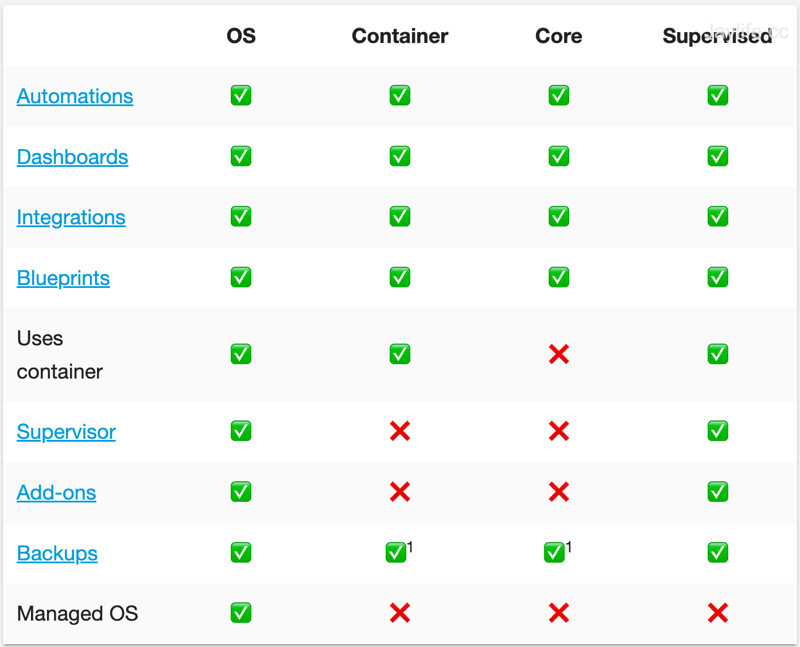

> 两种方式的功能和界面差异，OS侧边栏已经显示了部分我安装的Add-ons

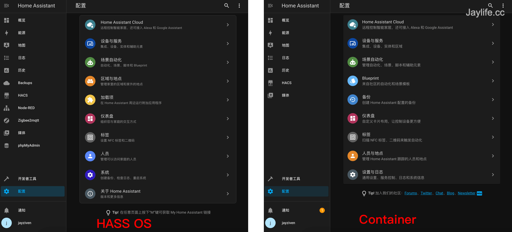

HassOS的安装方式可以选择虚拟机、树莓派或者直接买官方的Blue盒子，我手头正好有x86的软路由，所以就把HassOS安装在软路由虚拟机当中，我的软路由目前使用的是ESXI系统，下面是详细的安装教程。

### 使用ESXI安装和部署

#### 工具准备

> ESXI的系统安装大家可以在网上查询，如果有需要可以留言，我考虑单独出一期

首先到Home Assistant官网下载最新的系统，选择适用Linux虚拟机的vmdk文件。

 - [系统下载](https://www.home-assistant.io/installation/linux)
 - 硬件配置：2GB RAM，32GB Storage，2vCPU

#### 安装

1，登陆ESXI，创建新的虚拟机，选择Linux系统，Debian 64位

2，选择安装存储位置
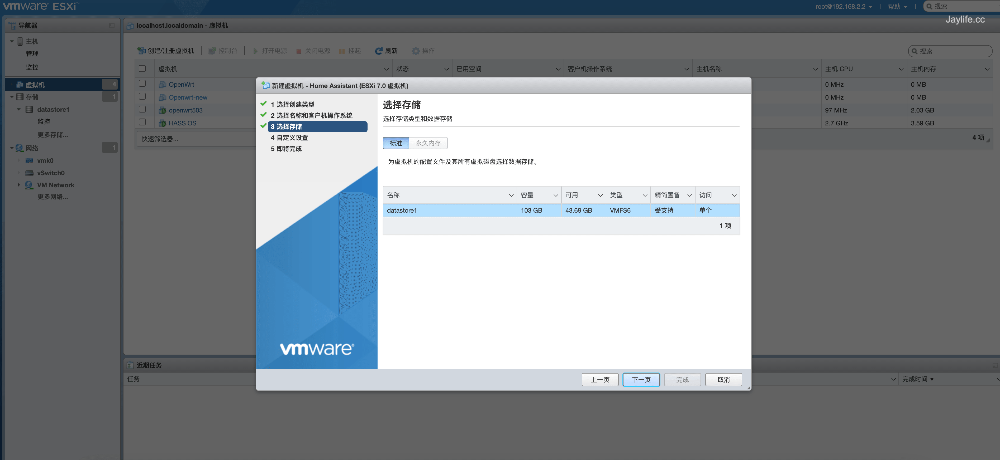

3，虚拟硬件选项中，将CPU设置位2、内存设为4Gb、删除默认硬盘和CD驱动器
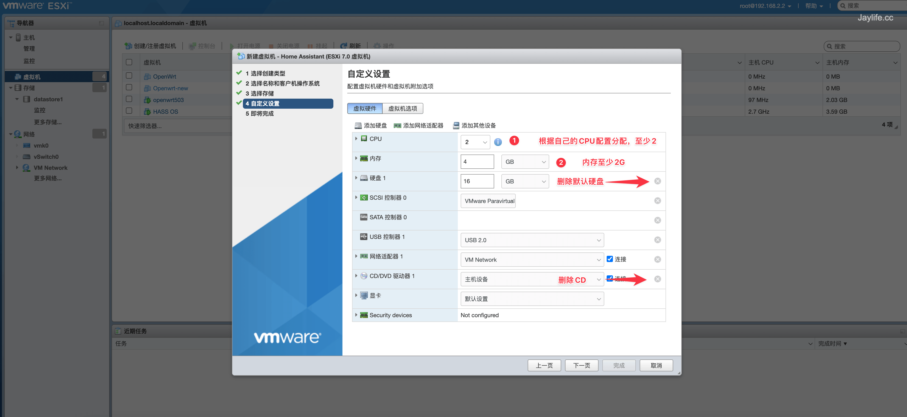

4，点击添加硬盘-现有硬盘
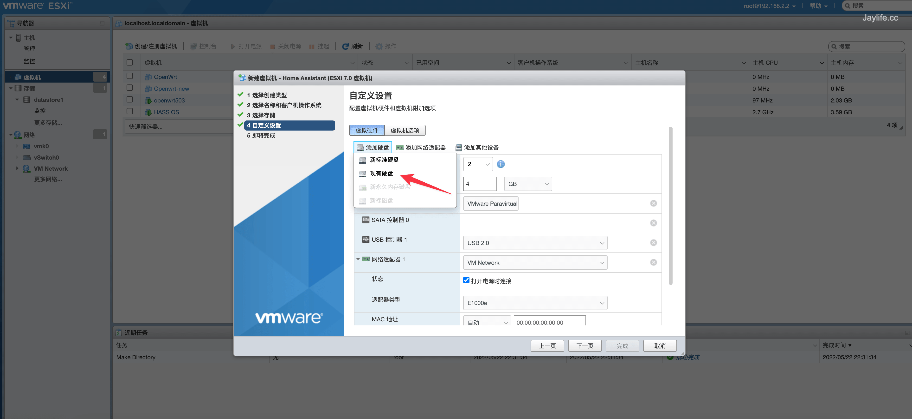

5，打开数据浏览器，创建目录，点击上传，将下载好的Home Assistant vmdk系统文件上传到该目录下，上传完成后选择然后返回设置页面
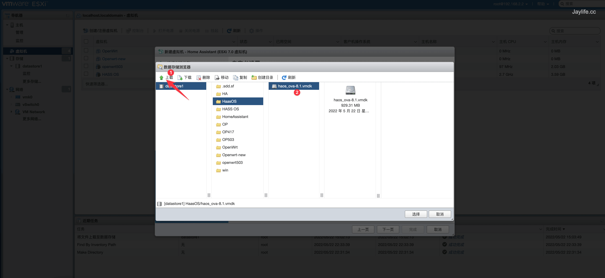

6，将新硬盘里的控制器位置改为IDE控制器0
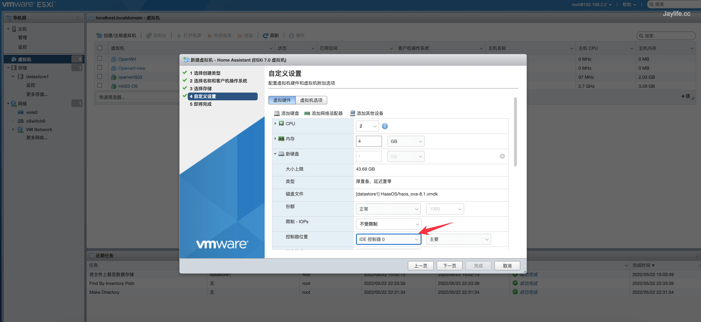

7，选择虚拟机选项Tab，将引导选项改为EFI
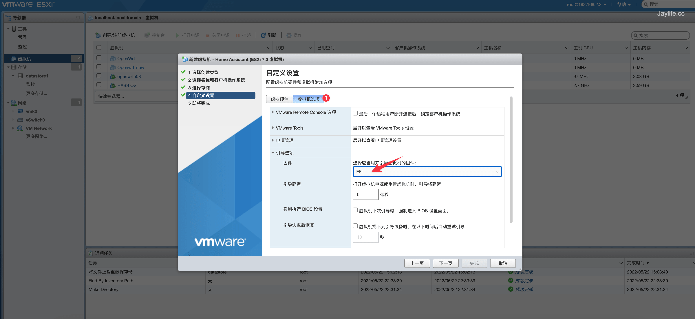

保存设置，打开虚拟机电源，当看Home Assistant字样时，代表HassOS安装完成，并且可以看到系统的登陆地址。
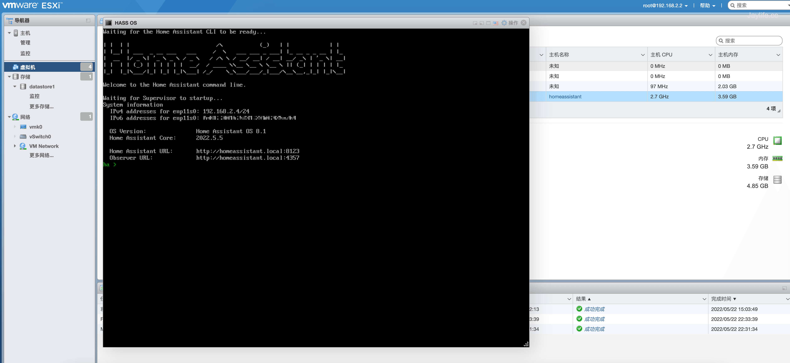

> 在安装过程中，可能会出现``Failed to start Wait Until Kernel Time Synchronized.``的错误提示，只要最后能进入IP地址页面，可以忽略。这个问题时有时无，不知道是什么问题，如果有知道的朋友欢迎留言讨论。

#### 初始化

在浏览器中打开ip:8123（ip就是ESXI中显示的地址），HA首先会进行初始化，这个过程时间比较长，耐心等待。直到页面出现账户创建，按步骤创建用户，进入HA。

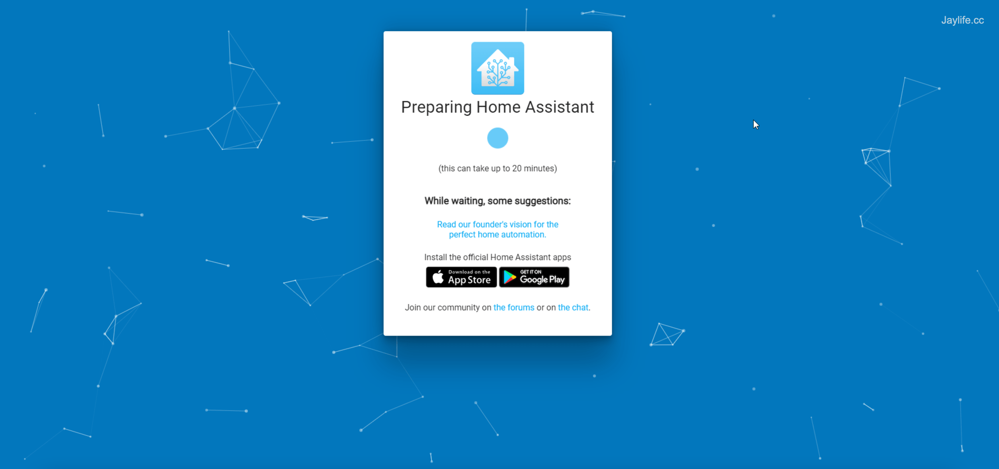

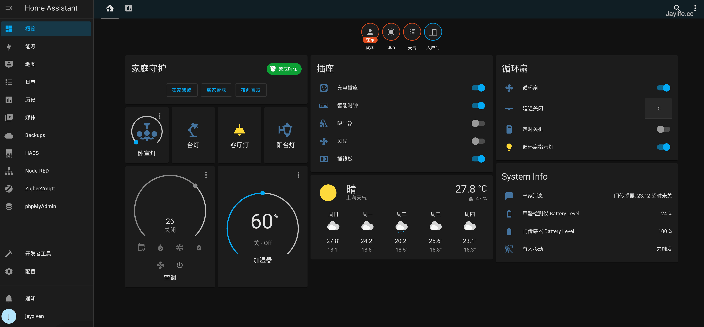

### Add-ons 推荐

从Container迁移到OS的安装主要是为了一些非常有用的Add-ons，当然如果你使用的是Container，也可以自己单独安装，只是相对来说更麻烦一点，而且没有办法统一在HA页面中管理，这里我推荐几个非常好用的插件。

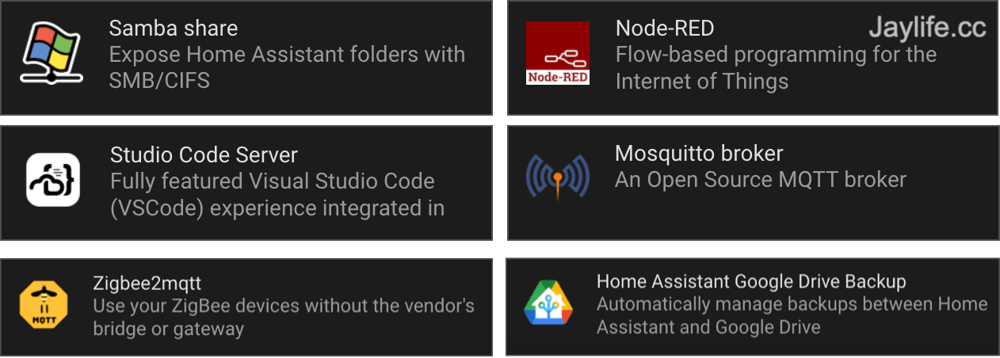

- **Samba Share**

通过电脑访问HA的配置文件，HA有些集成需要修改``configuration.yaml``文件，安装该插件后，可以利用SMB的方式访问HA的文件，便于在电脑上修改。

- **Studio Code Server**

安装Studio Code Server后，可以直接在浏览器中修改``configuration.yaml``文件，或其他HA系统文件。

- **Home Assistant Google Drive Backup**

提供自动备份HA系统，并同步到Google云盘，强烈推荐大家开启自动备份，HA系统更新频繁，如果遇到新系统不兼容，可以回滚备份回到之前的版本。

- **Node-RED**

Node-RED是一款强大的可视化数据流自动编程工具，配合HA可以视觉化的搭建场景和调试数据流转。

- **Zigbee2mqtt**

如果你有大量不同厂商的Zigbee设备，那Zigbee2mqtt是非常值得推荐的插件，该插件可以将Zigbee2mqtt获取到的Zigbee设备集成进HA，不过需要配合MQTT插件和Zigbee2mqtt网关硬件来使用，后续我会单独出教程介绍。

### 智能家居是否真的智能？

希望上面的教程对你入门Home Assistant有帮助，当然这仅仅是安装好HA而已，远没有到可用阶段，还需要安装集成来连接设备、安装APP与手机联动、桥接到HomeKit实现Siri控制...等等，繁多的设置可能也是HA劝退很多用户的原因吧，如果你也对HA感兴趣，大家可以一起交流学习。

其实智能家居远没有到“智能”的程度，一切的行动取决于你的预设，你需要按自己的习惯建立一系列的场景命令集，实现设备的自动化，它不知什么时候该做什么，可能因为你生病，并不需要开空调，但是它还是会按预设的命令执行，这个时候需要你介入矫正，而矫正过后，它并不会记住和学会，下次还是照旧执行。

目前的智能家居只是“自动化系统”、可以联网的“自动化系统”，它是否好用、是否让你舒服，完全依赖你自己对自己生活的场景化理解，然后转变成一条条自动化命令，这需要一些系统逻辑，可能在你让自己变舒服之前，这些命令的编辑就让自己崩溃了。

即便如此，当你进入家门时，灯光为你开好、气温适宜、Siri喊出“欢迎回家”，也是足以让我感受到科技生活的美好。
