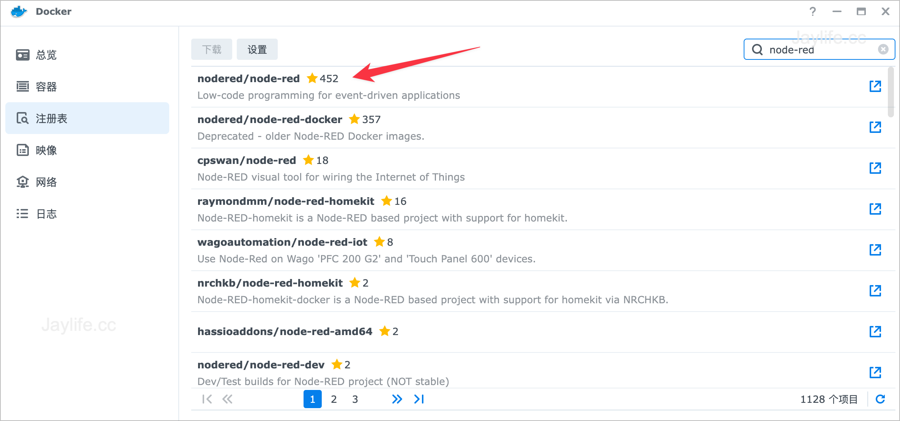
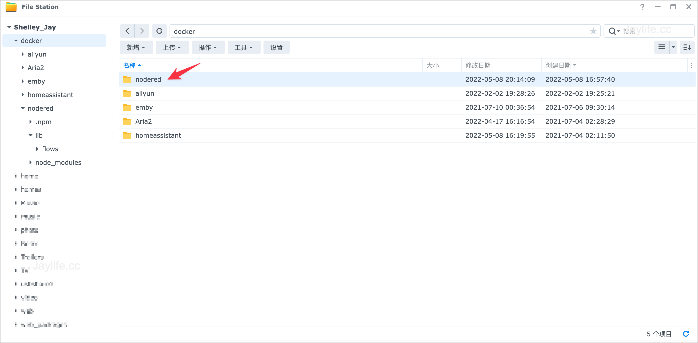
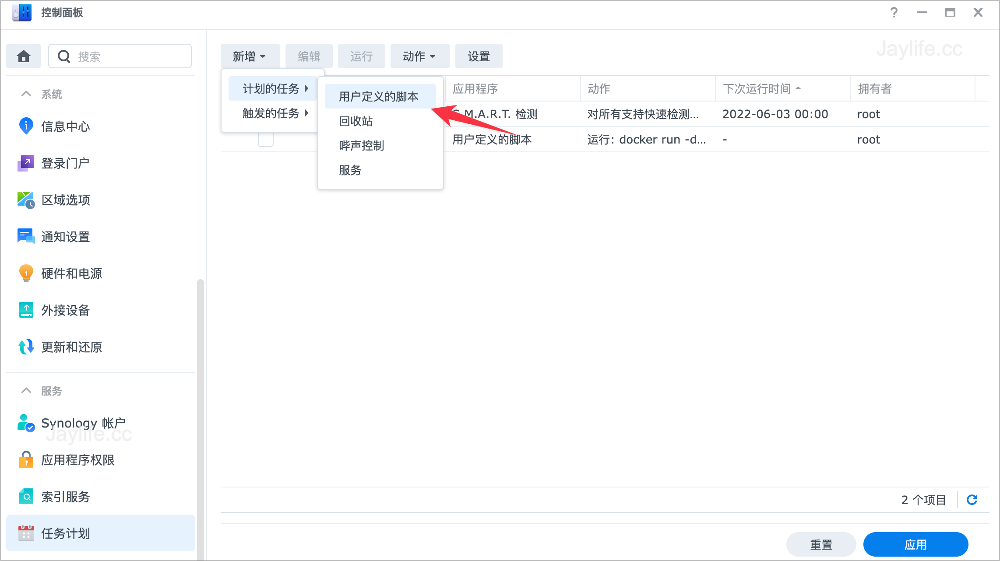
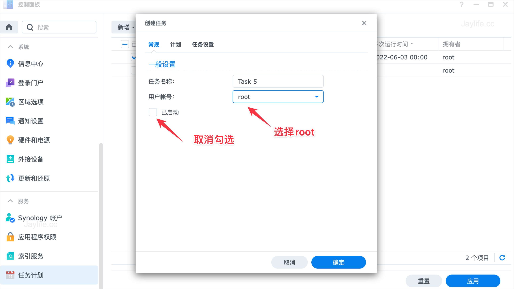
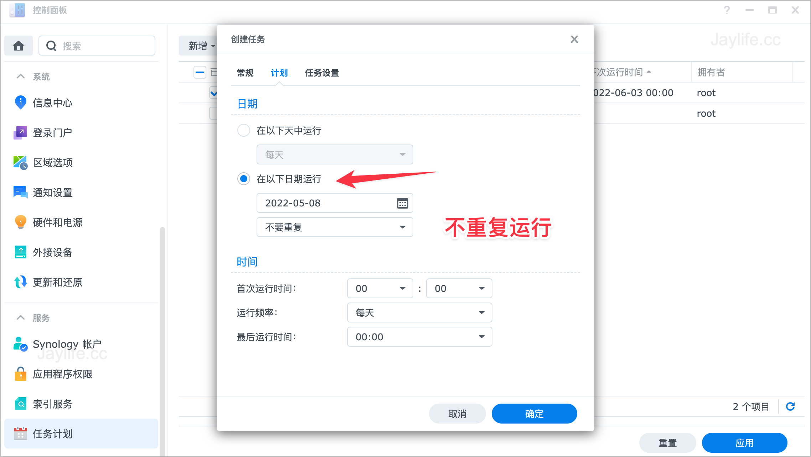
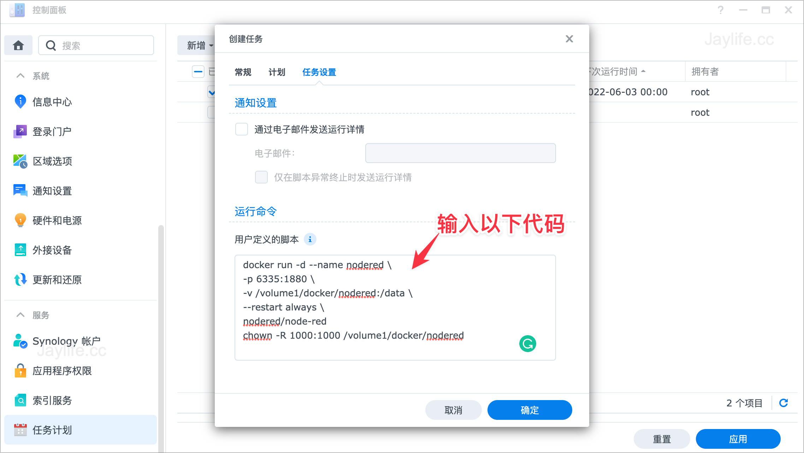
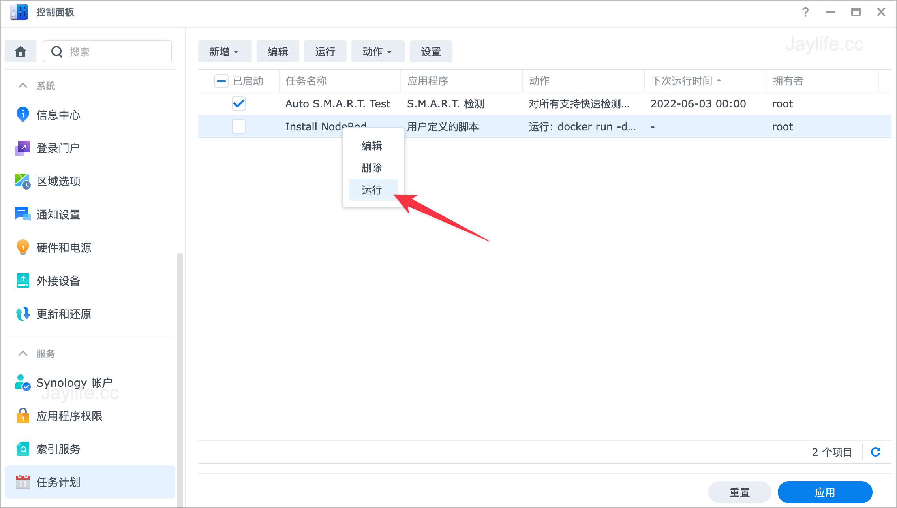
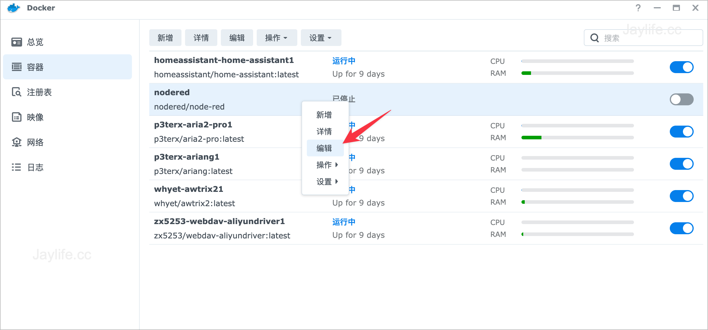
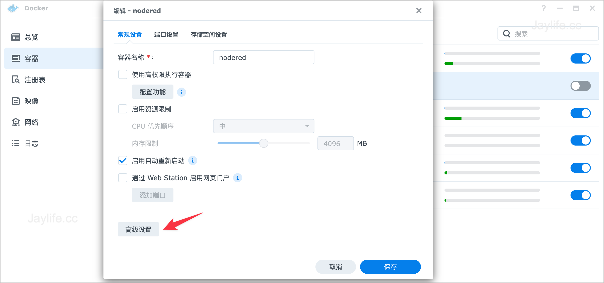
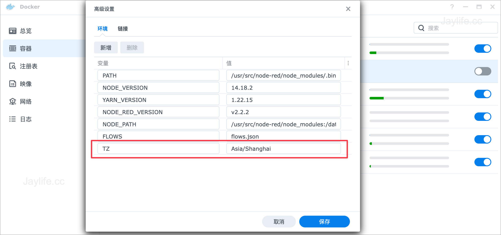

### Node-RED与Home Assistant配合使用

Node-RED是一款强大的可视化数据流自动编程工具，只需要简单的搭建Node节点，就能实现想要的自动化处理功能，非常适合与Home Assistant配合使用，实现智能家居的自动化场景。当然HA自带有自动化功能，但是Node-RED强大的节点参数，可以搭建出更丰富的自动化体验，最重要是搭建过程可视化，易于理解。

我的HA是安装在群晖Nas上面，因为是Docker版本，没有Add-on商店，所以需要单独安装Node-RED Docker版本来使用，但是在安装过程中遇到一个坑，花了好长时间才解决，分享一下解决思路，希望对你有帮助。

### 在Nas上安装Node-Red

按照官方[教程](https://github.com/node-red/node-red-docker)，通过群晖NAS的Docker套件安装，会出现这个错误提示：

```
> node $NODE_OPTIONS node_modules/node-red/red.js $FLOWS "--userDir" "/data"
```

其实是权限问题，官方也给出了解决办法，采用root进行安装即可解决，但是对于使用群晖Docker套件的朋友来说，命令行还是门槛太高了，经过一番折腾，找到了适合群晖用户的解决办法，利用计划任务的用户自定义脚本来完成。

#### 下载Node-RED镜像

打开群晖Docker套件，搜索node-red，下载镜像



在docker文件夹内创建nodered文件夹



#### 通过任务计划安装

1.打开控制面板-任务计划，点击新增，创建用户自定义的脚本



2.在常规选项中取消勾选``已启动``，用户账户选择``root``用户



3.在计划选项中，选择不重复运行


4.在任务设置中，输入以下用户定义的脚本命令，点击保存，系统会提示root脚本的风险，点击确认


```
docker run -d --name nodered \
-p 1880:1880 \
-v /volume1/docker/nodered:/data \
--restart always \
nodered/node-red
chown -R 1000:1000 /volume1/docker/nodered
```

5.返回任务计划列表，右键刚才创建的任务，点击运行，过1-2分钟之后，可以在群晖的Docker套件中，看到node-RED容器运行成功


#### 修改时区
在群晖Docker套件中，编辑``nodered``容器，在高级设置中，添加一行变量TZ="Asia/Shanghai"








重新运行node-RED容器，通过群晖IP+1880端口进行访问，这个时候就会发现可以正常使用了。我也是第一次尝试Node-RED，后面会继续给大家分享Node-RED与HA的自动化场景设置的玩法。
