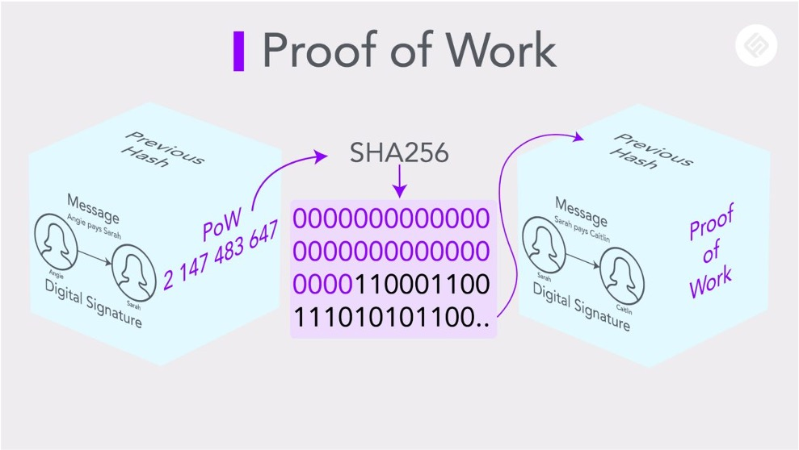

### 元宇宙里那些神秘的概念

元宇宙、NFT、Web3、数字钱包、DeFi、GameFi...，时下这些神秘又“高大上”的词汇，相信你多少都听别人说过，亦或者在新闻里看到过，虽然没人能讲清楚元宇宙是什么，但元宇宙的概念已然让快要死寂的科技圈躁动起来，甚至超过当年iPhone4发布会、互联网+PPT创业的热潮。

这些词是不是资本为了收割韭菜而编造的概念呢？还是说未来的科技生活确实迎来了巨变前的黎明？结论暂且不表，解开困惑的最好方法就是去了解这些概念是被谁、在什么情景、什么时间点被提出来的。

### 元宇宙起源

“Metaverse”一词是尼尔•斯蒂芬森在1992年出版的小说《雪崩》中创造的，可能作者都想不到在30年后，Metaverse会成为全球的热点，我看的版本Metaverse中文被翻译成“超元域”，有着非常强烈的IT、黑客世界的感觉。

从时间线看，国内在去年已经有媒体在报道元宇宙相关的新闻，真正达到全国热点，基本上是这三个事件的推动：Facebook宣布全面转向元宇宙、字节收购Pico、Facebook更名，国外在Facebook更名之后也达到了讨论的高点。

至此之后，科技圈、科技媒体都近乎疯狂解读发文，凡是大公司有一些沾边的东西，就会被媒体解读成元宇宙，比如今年微软收购动视暴雪，也被解读成是微软在元宇宙方向的投入。到底是不是，这里不讨论，但我认为大量这种蹭热点式的解读，足以说明，科技圈太需要新的东西了，尤其是资本。


一切新事物的诞生都伴随着危险和机遇，元宇宙到底是什么？我们先看看全球大佬是如何评价的：

> **马斯克说**：the metaverse is more of a marketing buzzword than a practical concept。元宇宙是个营销词。

> **比尔盖茨**：the metaverse will host most of your office meetings within ‘two or three years’。可能是从Facebook中看到了未来办公的新形态，告诉大家MS Office也会尝试这个方向。

> **扎克伯格**：the metaverse is the next chapter for the internet。对于All In元宇宙的小扎，确实需要有这样的信仰和魄力。

> **刘慈欣**：元宇宙将是整个人类文明的一次内卷。

我部分赞同马斯克和刘慈欣的看法，当前的元宇宙是一个过度营销的词语，是科技圈的一次大内卷，互联网当前已经没有爆发式的增长点了，需要让投资人看到未来。

不过这次元宇宙概念的讨论，也让更多人包括我，了解到了一些技术的发展和潜力，元宇宙能不能实现我不知道，但这些新的技术带来了非常有想象空间的价值，区块链再一次走到了科技舞台中央，NFT、Web3这些新生的相关技术，也被越来越多的人关注。

在讨论元宇宙是什么之前，我想有必要先了解一下元宇宙所涉及的这些技术是什么，带来的价值在哪里。下面按我的理解，浅显快速的普及一下这些技术。

### 区块链

2008年，中本聪发布了《比特币白皮书》，一种点对点的电子现金系统，讲述了区块链在加密货币的应用原理，从此区块链进入大众被讨论，也因为首次应用在比特币，很多人分不清比特币和区块链是什么关系。

其实，区块链是一种技术，分布式存储和去中性化是其核心特点，比特币是一种虚拟货币，是区块链的一种应用，通过了解比特币的工作原理，可以了解区块链技术的价值。

比特币作为一种无中心结算的电子现金或者虚拟货币，需要解决三个问题：如何防伪？如何防串改？如何实现全网信息一致？

#### 如何防伪

为了方便理解，借用传统的银行支付概念，区块链里的私钥=银行卡+身份证+支付密码；区块链里的公钥=银行卡号。转账的过程如下：

>1. 你转账给另一个人，使用你的私钥对转账进行加密签名
>
>2. 将转账信息和你的加密签名，以及公钥信息全网广播
>
>3. 收到你消息的用户，使用你的公钥和加密签名，解析出转账信息
>
>4. 解析出的转账信息与收到的转账信息一致，则确认为你本人

这里面的加密签名、以及公钥解析等涉及密码学知识，这里不做解释，可以将转账过程简单理解成上述的步骤。这意味着你的私钥是非常重要的，是你身份和密码的象征，拥有私钥可以操作你的一切资产。

而公钥是可以对外公开，也是其他人转账给你时的收款地址。私钥可以解析出公钥，反过来则不行，就行你知道你的银行卡号，但是知道银行卡号的人并不知道持卡人是谁。

#### 如何防串改

区块链的“链”字，非常形象的表达出区块链的特性之一，就是其信息的链接关系。所有记录在区块链的信息，以区块的形式进行打包，区块与区块之间有一个关联字段：Hash，前者的Hash值会记录在后者区块中。当区块的信息发生变动时，Hash值会改变，也意味着你需要同时修改此区块之后的所有区块信息，来保证Hash值前后一致。


#### 如何实现全网信息一致

保持全网信息一致，是区块链能实现去中心化的关键，如何做到网络中没有恶意节点呢？这就需要靠区块链的共识机制，以比特币为例，采用的共识机制为POW+最长链。简单理解共识机制就是全网都一致认可的规定，并且这个规定不会被攻击或者恶意混淆的可能。

以前面说的转账为例，当你转账并全网广播出去后，收到你消息的所有节点会开始计算一道数学题，谁最先算出SHA256前几十位为0的人，拥有打包权，其他节点进行验证，验证通过后一致认可此区块，并挂载到自己节点的链上。而这道数学题需要耗费真实世界的算力，间接提高了恶意节点的成本。



区块链最重要的特点为去中心化、信息分布式存储不可串改，这给了很多想创造出人人共享互联、没有垄断寡头的真正互联网体验，带来了可能，所以区块链也被认为是元宇宙非常重要和核心的技术。

当然区块链也有其问题，诸如交易速度慢、公链数据隐私性不好、扩展性差、各个区块链无法打通等等，我相信这些问题终将被解决，就像以太坊的诞生，已经比比特币链具备了更强的扩展性。

> 区块链工具

```
# 公链交易数据查询
https://www.blockchain.com/explorer
https://etherscan.io/

# 公链节点数查询
https://bitnodes.io/

#钱包工具
https://metamask.io/
https://token.im/

```
### NFT

#### 什么是NFT

如果区块链上存储的不是电子货币账本，而是媒体数据会怎么样？其实就是大家讨论的NFT。

NFT，全名Non fungible Token，中文译名非同质化代币，本质就是在区块链上存储了媒体数据，并且媒体数据是唯一且不可分割的，和存储的电子货币不一样，我的10元和你的10元是没有区别，是等价的，而NFT存储的媒体数据，就像现实生活中的物品一样，拥有唯一所属权，我买的房子和你买的房子，虽然都是100平，所属权不一样。

这也是为什么NFT在元宇宙概念里这么受推崇，元宇宙真正什么样子不知道，但是大家的共识是，元宇宙里会有很多虚拟资产，而NFT的出现解决了这些虚拟资产的确权问题，为元宇宙的虚拟资产繁荣提供了保障。

NFT目前确实做到了虚拟资产的确权，也就是唯一性问题解决了，但是既然叫资产，就得具备资产的价值，目前大部分的NFT项目并没有带来实际的资产价值，更多的是被大V炒作、资本炒作用来收割韭菜的工具。除了少数具有收藏价值的艺术品外，我认为NFT化的虚拟资产是否有价值，取决于资产是否能创造价值，而不是沦为投机交易的媒介。就好比真实世界，我买了一辆汽车，我可以用这辆车去开滴滴创作价值。

因此，目前的大部分NFT只是套了一个虚拟资产而没有资产价值的壳，大家谨慎购买。

#### 如何制作NFT

制作NFT的方法有很多，本质就是将自己的媒体数据上链存储，这里介绍一种普通用户可以制作的方法，利用OpenSea交易平台来制作。

**1. 注册一个数字钱包**

这里推荐以太坊钱包MetaMask，https://metamask.io/ 下载后按步骤注册即可，千万保存好自己的私钥和助记词。


**2. 登陆OpenSea制作**

安装MetaMask浏览器插件，打开OpenSea官网，使用钱包进行登陆


**3. 上传作品**

选择``Create``创建作品，按步骤上传自己的数字媒体，这里以图片为例。在创建时，记得勾选Freeze metadata，这样你的数字媒体才能上公链，否则媒体只是保存在OpenSea官方服务器。


**4. 支付费用发布**

上链需要支付以太坊费用，以我这张图片为例，大概的费用在$2美刀，支付后即可发布。发布后可以设置是否售卖以及售卖的价格


#### 国内的NFT生态

国内的NFT环境比较尴尬，由于众所周知的原因，一方面国内没有被世界广泛使用的公链，另一方面国内不允许NFT进行交易，这就导致NFT仅存的一点点收藏和交易价值都无法释放。所以国内目前宣传的NFT数字藏品，更像是挂着NFT概念的商品，甚至不如商品，商品我如果用着不喜欢，还能卖掉，而国内的NFT基本上靠信仰去充值了。

### Web3.0

和元宇宙一样，Web3.0 又是一个非常热点而又难以解释清楚的概念，之所以拿过来一起介绍，是因为Web3.0同样也是基于区块链的技术、融入了NFT的核心理念来构造。

Web3.0是由以太坊的联合创始人Gavin Wood，在2014年提出，他认为Web3是互联网的一种愿景，服务不是由某一个单一服务商托管，更像是纯粹的算法，理论上所有人都可以托管。我理解Web3.0就是点对点、人人都可以提供服务的互联网。

回顾历史，Web1.0，我们只能从某个服务商获取内容，信息是单向的；Web2.0，我们可以利用某个服务商的产品，实现内容的双向沟通，比如写博客、发短视频、发Twitter等等，但你的数据不完全属于你，假如微博倒闭，你的账户没了、数据也没了；而Web3.0希望带来的是，每个人都可以是互联网的服务者，数据永不丢失并且属于互联网的个体，听起来非常难想象，这里以IPFS举例。

> **Web2.0看电影**
> 
> 假如现在你要看一部流媒体电影，你需要打开浏览器，输入Netflix，搜索电影名字，观看，所有的服务是Netflix提供，电影存储在Netflix。

> **Web3.0看电影**
> 
> 电影发行方，将电影上链保存，所有链上的节点都变成了电影的服务提供方，当你需要看电影，直接输入ipfs://电影名字，自动将你与最近的节点连接观看。发行方通过所属权获得收益，节点通过服务获得收益，而数据不会因为某个单一的服务方当机、被黑或者倒闭而丢失。


这就是Web3.0的魅力，数据分布式存储、服务点对点提供、没有垄断寡头、数据归属用户，足以颠覆现在的互联网模式，这也是为什么大家认为Web3.0潜力非常大。当然，这里面需要解决的问题太多了，区块链本身的扩展性问题、速度慢问题、存储资源大小限制问题等等，但我相信Web3.0会有到来的一天，现在已经有一些不错的Web3.0产品，比如Mirror。

### 元宇宙和Web3.0的区别

元宇宙和Web3.0都是当下的热点，之所以前面给大家浅显的介绍区块链、NFT的内容，是因为元宇宙、Web3.0都深度依赖区块链和NFT的发展，两者有一些共同的特性，去中心化、人人参与、数据归属用户等，但是，从概念或者愿景上来讲，两者有很大的差别。

元宇宙从概念上讲，它是要复刻一个数字化的世界，在这里，用户可以拥有自己的身份、数字钱包、享受和现实一样的消费娱乐社交等，但又不完全脱离现实世界，比如可以通过AR、VR设备，穿越到异国他乡，和好友相约在埃菲尔铁塔。而Web3.0的终极目标是实现点对点的服务的互联网，两者在数字化、互联的部分是有交集的，Web3.0的发展可以促进元宇宙里数字化的体验，但Web3.0不追求连通物理世界。这是我认为两者的最大差异。

所以元宇宙的概念更大、更泛，也因此很难有共识性的产品方向诞生，而Web3.0的生态伴随区块链的发展，已经陆续有很多有意思的产品出来，相信不久就能诞生颠覆性的产品。


### 一些有意思的元宇宙、Web3产品

- Gather：https://www.gather.town/，体验元宇宙办公
- Axie infinity ：https://axieinfinity.com/，一款将NFT回合制游戏
- Mirror：https://mirror.xyz/，内容永久存储和分享社区
- ENS：https://ens.domains/，去中心化的域名服务
- metamail：https://metamail.ink/login，Web3 Email服务

