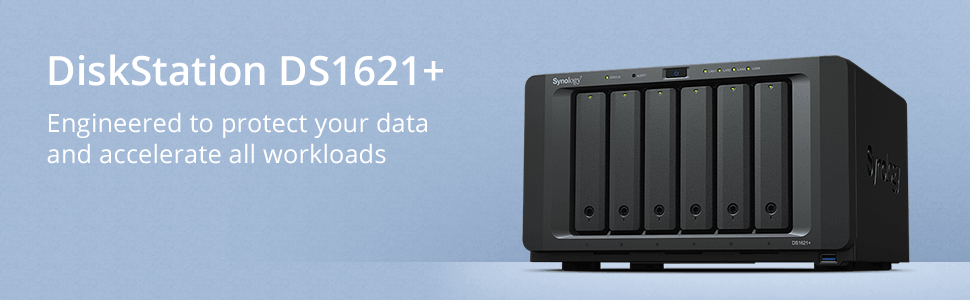

### 重新开始
13年过去了，我又重新开始写博客

上一次写博客还是2009年，大学时候除了学习，就是喜欢捣鼓科技产品和网络，自学搭建了一个Wordpress，也加入了博客圈，大家相互交流，发表自己的生活感想，亦或是把自己知道的新技术、新知识分享出来，相比现在的浮躁和快节奏的生活，那时候有价值的网络内容真的很多，是博客的黄金时代。

最近发生了很多事情，上海的疫情、工作上的裁员、互联网人35岁的焦虑，我开始思考自己未来的生活，以及应对将来要发生的一些变化，博客是一个帮助我思考的很好的工具，顺带把自己在生活中、工作中和网络中发现的有趣的内容分享出来，也算是自己的学习的沉淀，所以打算重新开始写博客，不设目标，重在沉淀和分享。

### 我会分享哪些内容
从大学开始就喜欢捣鼓科技产品和网络，以为年纪大了，就不会折腾了，现在依然能从科技产品和网络的折腾中学习到知识和获得乐趣，我会从自己在用的一些产品开始，给大家分享。

下面这些产品极大地提升了我的生活品质和乐趣，如果你和我一样，不懂编程，但是对这些产品感兴趣又不知如何入手，欢迎关注，后面我将陆续出系列教程。

- **NAS产品：DS1621+**

- **OpenWrt和软路由产品：4415U**

- **Home Assistant和智能家居产品**

